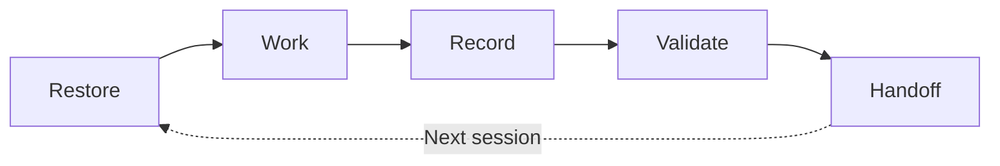

<!-- R1 image slot: docs/images/readme-product-identity.en.png -->

<p align="center">
  
</p>

<div align="center">

<h1>🧵 RecallLoom</h1>

<p><strong>Keep project context intact across AI sessions.</strong></p>

<p>RecallLoom stores background, progress, key decisions, and next steps in project files, so the next AI session can continue from the current state.</p>

[](./docs/releases/v0.4.0.md)
[](./skills/recallloom/package-metadata.json)
[](./skills/recallloom/package-metadata.json)
[](./LICENSE)
[](https://github.com/Frappucc1no/recall-loom/stargazers)

**English** · [简体中文](./README.md)

</div>

> [!TIP]
> If returning to a project means spending ten minutes re-explaining where everything stands, RecallLoom reduces that restart tax with a smaller, current, project-owned starting point.

| What it keeps | When it helps | Where it lives |
|---|---|---|
| Background, progress, key decisions, next step | New session, new model, new tool, or coming back later | Markdown / JSON files in your project |

**Quick links:** [Why](#why-recallloom) · [Start](#30-second-start) · [Features](#features) · [Core Capabilities](#core-capabilities) · [Project Memory Loop](#project-memory-loop) · [Fit](#fit) · [Compare](#common-alternatives) · [Design](#engineering-design) · [Version History](#version-history) · [Documentation Map](#documentation-map) · [FAQ](#faq)

## 🧭 Why RecallLoom

In long-running AI work, the slow part is often explaining the project again.

You have probably seen this pattern:

- A new session, model, or tool needs the same project background again.
- The repo is visible, but stale facts and current decisions are mixed together.
- Platform memory, chat history, and project files live in different places.
- Over time, "why this changed", "what is true now", and "where to continue" become hard to recover.

RecallLoom focuses on **project memory** and **project continuity**.

It keeps project background, current state, key decisions, recent progress, and the next step in controlled files next to the project. The next session can restore the current state first, then decide whether deeper history is needed.

That turns memory from temporary chat context into a readable, reviewable, project-owned engineering asset.

This README is the concise public entry point. Start here for setup and daily use; read [USAGE.md](./USAGE.md) for detailed commands, [skills/recallloom/SKILL.md](./skills/recallloom/SKILL.md) for installed skill behavior, and [INDEX.md](./INDEX.md) for the full repository map.

## ⚡ 30-Second Start

Install once. Initialize the project only when needed. After that, continue with plain language.

### 1. Install RecallLoom

Copy this command into your terminal. If you do not want to handle command details, you can ask your AI coding tool to run the whole line:

```bash
npx skills add https://github.com/Frappucc1no/recall-loom --skill recallloom
```

To update installed skills later:

```bash
npx skills update
```

### 2. First-Time Initialization (Optional)

If this is the first time RecallLoom is used in the current project, initialize project memory first. If the project already has a valid `.recallloom/` directory, you can skip this step.

Any of these explicit invocations can work:

```text
@recallloom initialize this project
Use RecallLoom for this project
Initialize this project with RecallLoom
rl-init
```

You can also select `recallloom` from your AI tool's skill picker, then say `initialize this project`.

> [!NOTE]
> First attach creates the RecallLoom project-memory directory next to the project. That directory stores background, progress, key decisions, and the next step.

### 3. Daily Use: Continue in Plain Language

After the project is attached, normal prompts are enough:

```text
continue this project
restore project context first
pick up where we left off
record today's key progress
```

> [!TIP]
> In an attached project, `continue this project` gives RecallLoom the first recovery step: read project memory first, then work on the task. You do not need to write `@recallloom` every time.

### 4. Short Triggers for Familiar Users

These can be typed directly into an AI tool as shorter action phrases:

| Direct input | What you want |
|---|---|
| `rl-init` | **Initialize project memory** and attach RecallLoom to the current project |
| `rl-resume` | Restore background, current state, and next step |
| `rl-status` | Check whether project memory is complete and ready |
| `rl-validate` | Check continuity files for structural issues |

Most of the time, `continue this project` is enough. Use short triggers when you want a faster operator-style path.

<details>
<summary>Version and compatibility</summary>

<!-- RecallLoom metadata sync start: package-metadata -->
- package version: `0.4.0`
- protocol version: `1.0`
- supported protocol versions:
  - `1.0`
<!-- RecallLoom metadata sync end: package-metadata -->

</details>

<details>
<summary>Environment and entry files</summary>

<!-- RecallLoom metadata sync start: runtime-assumptions -->
- Python 3.10 or newer
- supported workspace languages:
  - `en`
  - `zh-CN`
- supported bridge targets:
  - `AGENTS.md`
  - `CLAUDE.md`
  - `GEMINI.md`
  - `.github/copilot-instructions.md`
<!-- RecallLoom metadata sync end: runtime-assumptions -->

</details>

## ✨ Features

> [!TIP]
> RecallLoom saves time by shortening the recovery path: less re-explaining, less rereading, less guessing before the AI tool starts work.

| Feature | Value |
|---|---|
| **Lower restart tax** | Restore project state when you switch sessions, switch models, or return later |
| **Faster handoffs** | Start from the current summary, recent progress, and next step |
| **Context-efficient restore** | Read small, focused project memory first; go deeper only when needed |
| **Cross-tool continuity** | Keep project state with the workspace across models, sessions, and AI tools |
| **Controlled memory updates** | Use clear paths for progress records, current summaries, and validation |
| **Plain files** | Store memory in Markdown / JSON files that are readable, reviewable, and portable |

## 🧩 Core Capabilities

| Capability | What it means for you |
|---|---|
| Restore project context | New work starts from current facts instead of rebuilding history from scratch |
| Record key progress | Durable progress, decisions, and next steps are written back next to the project |
| Validate continuity state | Missing, stale, conflicting, or risky continuity files are easier to spot |
| Guard current-state updates | Revision and freshness checks reduce accidental stale writes |
| Handoff across tools | Keep handoff files readable across AI tool workflows such as Codex, Claude Code, Gemini, and others |

Together, these capabilities solve one problem: the next AI session should know the current project state before it starts acting.

## 🔁 Project Memory Loop

RecallLoom's core model is a **project memory loop**:

<!-- R2 image slot: docs/images/readme-continuity-loop.en.png -->
<p align="center">
  
</p>



| Step | What happens |
|---|---|
| **Restore** | The new work entry reads a small set of current project facts |
| **Work** | The AI tool continues from that state |
| **Record** | Key progress, decisions, and next steps are written back |
| **Validate** | Continuity files are checked for missing, stale, or conflicting state |
| **Handoff** | The next session can continue from those files |

The loop makes memory inspectable: restore trusted current facts, do the work, then write the new facts back.

<details>
<summary>Where is project memory stored?</summary>

| Question | RecallLoom file |
|---|---|
| What is this project and why is it shaped this way? | `context_brief.md` |
| Where does the project stand now? | `rolling_summary.md` |
| What actually happened recently? | `daily_logs/YYYY-MM-DD.md` |
| Which rules, boundaries, and state need care? | `config.json`, `state.json`, `update_protocol.md` |

</details>

## 🎯 Fit

RecallLoom is a good fit for:

| Scenario | Value |
|---|---|
| Long-running software projects | Keep implementation state, decisions, blockers, and next steps recoverable |
| Product docs / PRDs / RFCs | Preserve scope changes, decision reasons, open questions, and collaboration context |
| Research writing | Track claims, evidence, source boundaries, and writing progress |
| Multi-tool AI work | Move across models, tools, and sessions without losing the current project state |
| Private or local-first workspaces | Keep project state inside the workspace, easier to review and move |

> [!IMPORTANT]
> RecallLoom focuses on project continuity. It does not replace a knowledge base, database, backend service, or autonomous agent framework.

It is not meant for:

- One-off questions or disposable chats.
- Chat-history summaries only.
- Automatic whole-repo organization.
- Full knowledge-base, backend-service, or autonomous-agent systems.
- Silent extraction, merging, or rewriting of long-term facts without confirmation.

## 🆚 Common Alternatives

This comparison is based on public docs and common usage patterns. It is not a ranking: most of these approaches can live alongside RecallLoom. The difference matters when the problem is no longer only "make the tool follow rules", but "let a project resume across sessions, tools, and collaborators."

| Adjacent approach | Representative examples | Best for | Where RecallLoom is different |
|---|---|---|---|
| Agent instructions / rules | `CLAUDE.md`, `AGENTS.md`, Cursor Rules, Continue rules | Coding conventions, test commands, project constraints, and tool behavior | Keeps current facts, recent progress, decisions, and the next step, not only behavior rules |
| Platform memory | Claude Code auto memory, ChatGPT Memory | Preferences, habits, and continuity inside one host tool | Keeps readable context in project files so handoffs can move with the workspace |
| Codebase context / retrieval | Aider repo map, Continue context providers | Finding relevant code, files, symbols, and external context | Helps a new session understand where the project stands before going deeper |
| Structured AI project memory | Cline Memory Bank, `project-brain` | Explicit Markdown project brief, active context, progress, and handoff state | Keeps the file-based handoff model, while packaging it as an installable skill with explicit bridge targets, status checks, validation, and guarded update paths |
| Human knowledge bases / team wiki | Obsidian, Logseq, Notion | Research notes, linked knowledge, team docs, and long-term lookup | Gives AI sessions a shorter current-state restore path instead of a broad knowledge library |
| Manual handoff | `HANDOFF.md`, session summary, README TODOs, issue notes | One-time pause points, task lists, or end-of-session summaries | Turns handoff notes into a maintainable, reviewable, checkable project-memory loop |

Simple rule: rules guide how to work; retrieval shows what to inspect; knowledge bases store what people know; RecallLoom keeps where the project stands and where to resume.

## 🏗️ Engineering Design

RecallLoom follows a simple engineering rule: project facts stay with the project; AI tools are entry points.

<!-- R3 image slot: docs/images/readme-architecture-boundary.en.png -->
<p align="center">
  
</p>

| Design choice | Meaning |
|---|---|
| Project-adjacent memory directory | `.recallloom/` travels with the workspace, so the project can be restored across tools |
| Plain files for durable facts | Key state lives in readable Markdown / JSON files that can be reviewed, rolled back, and moved |
| Current before history | Read current state and key facts first; go deeper only when needed |
| Write guards | Check revisions, freshness, and structure before updating long-term project facts |
| Tools as entry points | AI tools invoke RecallLoom; RecallLoom files carry the project state |

Detailed script entrypoints, protocol notes, and file contracts live in [`USAGE.md`](./USAGE.md) and [`skills/recallloom/references/`](./skills/recallloom/references/).

## 🕰️ Version History

| Version | Highlights | User value |
|---|---|---|
| `v0.4.0` | More accurate restore paths, lower-friction progress updates, clearer write guards and tool boundaries | More reliable handoff across sessions, models, and tools; easier to know what should be synced after progress is recorded |
| `v0.3.5` | Faster restore, structured progress records, write previews, support-state checks | Existing projects are easier to resume, and write risks are visible before changes are applied |
| `v0.3.4` | Install/update status checks, initialization privacy boundaries, safer write foundations | Update state and local project memory are easier to control |
| `v0.3.x` | Plain-file project state, unified entrypoints, query support, daily logs, and current summaries | The base project-memory model for RecallLoom |

## 🗺️ Documentation Map

| Goal | Start here |
|---|---|
| Decide whether RecallLoom fits your project | This README |
| Install quickly and restore project context | [30-Second Start](#30-second-start) |
| See script and command details | [`USAGE.md`](./USAGE.md) |
| See the skill entry read by AI tools | [`skills/recallloom/SKILL.md`](./skills/recallloom/SKILL.md) |
| See protocol, file contracts, and bridge details | [`skills/recallloom/references/`](./skills/recallloom/references/) |
| See release history | [GitHub Releases](https://github.com/Frappucc1no/recall-loom/releases) |

## ❓ FAQ

### Will RecallLoom automatically edit my code?

No. RecallLoom's default working surface is the project-continuity files. Product code, docs, and other project files are still changed through your normal workflow. Durable facts are written back through controlled project-memory paths when needed.

### How is this different from platform memory?

Platform memory can be useful as a hint. RecallLoom keeps the durable project state next to the project itself: current state, key decisions, progress, and next steps live in project files.

### Does it require a database, backend service, or RAG?

No by default. RecallLoom uses a plain-file model: readable, reviewable, rollback-friendly text files hold the continuity state.

### Does it work for non-code projects?

Yes. It fits any project that spans days, sessions, models, or tools. Research writing, product docs, RFCs, course projects, and engineering coordination can all benefit.

### Can I attach it to an existing project?

Yes. On first attach, RecallLoom creates project memory and turns the current project state into a recoverable starting point. It does not require you to reshape the project into a special directory layout.

### Why not just ask the AI tool to read the whole repo?

Reading the whole repo costs more and still does not tell the tool which old facts are stale or which decisions are current. RecallLoom gives the tool a smaller, more trusted restore point first, then deeper material can be read when needed.

## 🙏 Acknowledgements

Thanks to the [Linux.do community](https://linux.do/) for discussion, feedback, and support.

## 📄 License

Apache-2.0. See [`LICENSE`](./LICENSE).
