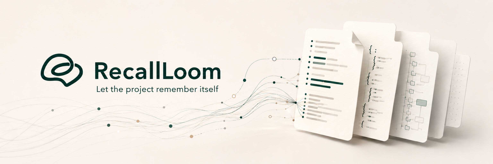
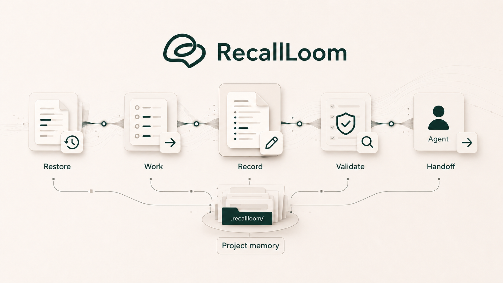
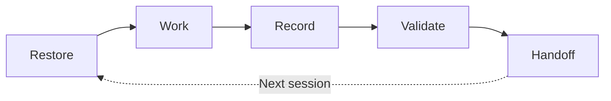
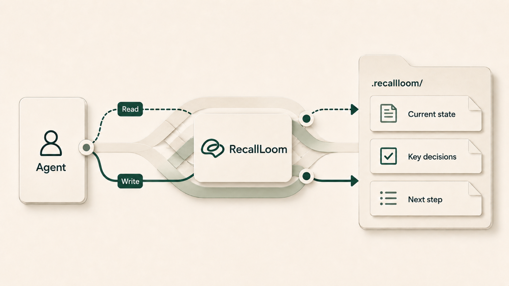

<!-- R1 image slot: docs/images/readme-product-identity.en.png -->

<p align="center">
  
</p>

<div align="center">

<h1>🧵 RecallLoom</h1>

<p><strong>Keep project context intact across AI sessions.</strong></p>

<p>RecallLoom is a file-based project memory layer for AI collaboration. It stores background, progress, key decisions, and next steps in Markdown / JSON files beside or inside the project, with no database, RAG layer, or background service required; the next session, model, or tool can more easily start from the current state.</p>

[](./skills/recallloom/package-metadata.json)
[](./skills/recallloom/package-metadata.json)
[](./skills/recallloom/SKILL.md)
[](./skills/recallloom/package-metadata.json)
[](./LICENSE)
[](https://github.com/Frappucc1no/recall-loom/stargazers)

**English** · [简体中文](./README.md)

</div>

> [!TIP]
> If returning to a project means spending ten minutes re-explaining where everything stands, RecallLoom reduces that restart tax with a smaller, current, project-owned starting point.

**Quick links:** [Why](#why-recallloom) · [Start](#30-second-start) · [Features](#features) · [Loop](#project-memory-loop) · [Fit](#fit) · [Compare](#common-alternatives) · [Docs](#documentation-map) · [FAQ](#faq)

<a id="why-recallloom"></a>

## 🧭 Why RecallLoom

In long-running AI work, the slow part is often explaining the project again.

You have probably seen this pattern:

- A new session, model, or tool needs the same project background again.
- The repo is visible, but stale facts and current decisions are mixed together.
- Platform memory, chat history, and project files live in different places.
- Over time, "why this changed", "what is true now", and "where to continue" become hard to recover.

RecallLoom focuses on **project memory** and **project continuity**.

It keeps project background, current state, key decisions, recent progress, and the next step in controlled files next to the project. The next session can restore the current state first, then decide whether deeper history is needed.

That turns memory from temporary chat context into a readable, reviewable, project-owned engineering asset.

This README is the concise public entry point. Start here for setup and daily use; read [USAGE.md](./USAGE.md) for detailed commands, [skills/recallloom/SKILL.md](./skills/recallloom/SKILL.md) for installed skill behavior, and [INDEX.md](./INDEX.md) for the full repository map.

<a id="30-second-start"></a>

## ⚡ 30-Second Start

Install once. Initialize the project only when needed. After that, in a host with the skill available, continue with plain language.

Prerequisites: Node/npm/npx, Python `3.10+`, and an AI coding host that can install/read skills.

Capability note: skills installation makes RecallLoom readable by the tool; `@recallloom` is a bridge/skill invocation; native `rl-*` shortcuts are host-dependent.

### 1. Install RecallLoom

Copy this command into your terminal. If you do not want to handle command details, you can ask your AI coding tool to run the whole line:

```bash
npx skills add https://github.com/Frappucc1no/recall-loom --skill recallloom
```

To update installed skills later:

```bash
npx skills update
```

### 2. Initialize If Not Attached

If this is the first time RecallLoom is used in the current project, initialize project memory first. If the project already has a valid `.recallloom/` or `recallloom/` directory, you can skip this step; if both exist, stop and inspect the project state first.

Any of these explicit invocations can work (`@recallloom` only works when the current host supports @ skill mentions; otherwise use plain language or the skill picker):

```text
@recallloom initialize this project
Use RecallLoom for this project
Initialize this project with RecallLoom
rl-init
```

You can also select `recallloom` from your AI tool's skill picker, then say `initialize this project`.

> [!NOTE]
> First attach creates the RecallLoom project-memory directory next to the project. That directory stores background, progress, key decisions, and the next step.

### 3. Daily Use: Continue in Plain Language

After the project is attached, normal prompts are enough:

```text
continue this project
restore project context first
pick up where we left off
record today's key progress
```

> [!TIP]
> In an attached project, `continue this project` gives RecallLoom the first recovery step: read project memory first, then work on the task. You do not need to write `@recallloom` every time.

### 4. Short Triggers for Familiar Users

In supported hosts, these can be typed directly into an AI tool as shorter action phrases:

| Direct input | What you want |
|---|---|
| `rl-init` | **Initialize project memory** and attach RecallLoom to the current project |
| `rl-resume` | Restore background, current state, and next step |
| `rl-status` | Check whether project memory is complete and ready |
| `rl-validate` | Check continuity files for structural issues |

If your current host does not recognize `rl-*`, use the plain-language prompts above.

Most of the time, `continue this project` is enough. Use short triggers when you want a shorter path.

<details>
<summary>Version and compatibility</summary>

<!-- RecallLoom metadata sync start: package-metadata -->
- package version: `0.4.8.1`
- protocol version: `1.0`
- supported protocol versions:
  - `1.0`
<!-- RecallLoom metadata sync end: package-metadata -->

</details>

<details>
<summary>Environment and entry files</summary>

<!-- RecallLoom metadata sync start: runtime-assumptions -->
- Python 3.10 or newer
- supported workspace languages:
  - `en`
  - `zh-CN`
- supported bridge targets:
  - `AGENTS.md`
  - `CLAUDE.md`
  - `GEMINI.md`
  - `.github/copilot-instructions.md`
<!-- RecallLoom metadata sync end: runtime-assumptions -->

</details>

<a id="features"></a>

## ✨ Features

> [!TIP]
> RecallLoom saves time by shortening the recovery path: less re-explaining, less rereading, less guessing before the AI tool starts work.

| Feature | Value |
|---|---|
| **Lower restart tax** | Restore project state when you switch sessions, switch models, or return later |
| **Faster handoffs** | Start from the current summary, recent progress, and next step |
| **Context-efficient restore** | Read small, focused project memory first; go deeper only when needed |
| **Cross-tool continuity** | Keep project state with the workspace across models, sessions, and AI tools |
| **Controlled memory updates** | Use clear paths for progress records, current summaries, and validation, reducing the risk of writing stale facts back into project memory |
| **Plain files** | Store memory in Markdown / JSON files that are readable, reviewable, and portable |

<a id="core-capabilities"></a>

## 🧩 Core Capabilities

| Capability | What it means for you |
|---|---|
| Restore project context | New work starts from current facts instead of rebuilding history from scratch |
| Record key progress | Durable progress, decisions, and next steps are written back next to the project |
| Suggest recording moments | Offer a sanitized candidate and next step after a durable milestone without writing silently |
| Validate continuity state | Missing, stale, conflicting, or risky continuity files are easier to spot |
| Guard current-state updates | Revision and freshness checks reduce accidental stale writes |
| Preview repairs | Diagnose, preview, confirm, and revalidate daily-log cursor repair without hand-editing `state.json` |
| Handoff across tools | Keep handoff files readable across AI tool workflows such as Codex, Claude Code, Gemini, and others when the relevant entry files are available |

Together, these capabilities solve one problem: the next AI session should know the current project state before it starts acting.

<a id="design-principles"></a>

## 🧱 Design Principles

- **The project owns its memory.** Key state lives in plain files beside or inside the project, not only in one chat or one platform memory.
- **Current before complete.** Restore current facts, recent progress, and the next step first; go deeper into history only when needed.
- **AI coding hosts are entry points.** When a host supports skills or the relevant entry files, it can read or invoke RecallLoom; durable facts stay in RecallLoom files for review and movement.

<a id="project-memory-loop"></a>

## 🔁 Project Memory Loop

RecallLoom's core model is a **project memory loop**:

<!-- R2 image slot: docs/images/readme-continuity-loop.en.png -->
<p align="center">
  
</p>



| Step | What happens |
|---|---|
| **Restore** | The new work entry reads a small set of current project facts |
| **Work** | The AI tool continues from that state |
| **Record** | Key progress, decisions, and next steps are written back |
| **Validate** | Continuity files are checked for missing, stale, or conflicting state |
| **Handoff** | The next session can continue from those files |

The loop makes memory inspectable: restore trusted current facts, do the work, then write the new facts back.

<details>
<summary>Where is project memory stored?</summary>

Behind the loop are a few file types:

| Question | RecallLoom file |
|---|---|
| What is this project and why is it shaped this way? | `context_brief.md` |
| Where does the project stand now, and which facts are still valid? | `rolling_summary.md` |
| What actually happened recently? | `daily_logs/YYYY-MM-DD.md` |
| Which rules, boundaries, and state need care? | `config.json`, `state.json`, `update_protocol.md` |

</details>

<a id="fit"></a>

## 🎯 Fit

RecallLoom is a good fit for:

| Scenario | Value |
|---|---|
| Long-running software projects | Keep implementation state, decisions, blockers, and next steps recoverable |
| Product docs / PRDs / RFCs | Preserve scope changes, decision reasons, open questions, and collaboration context |
| Research writing | Track claims, evidence, source boundaries, and writing progress |
| Multi-tool AI work | Move across models, tools, and sessions while reducing loss of current project state |
| Private or local-first workspaces | Keep project state inside the workspace for easier review and movement; privacy still depends on your sync and hosting setup |

> [!IMPORTANT]
> RecallLoom focuses on project continuity. It does not replace a knowledge base, database, backend service, or automation / execution framework.

It is not meant for:

- One-off questions or disposable chats.
- Chat-history summaries only.
- Automatic whole-repo organization.
- Task orchestration, step scheduling, or multi-agent execution; RecallLoom only maintains project-continuity state.
- Full knowledge-base, backend-service, or automation / execution-framework systems.
- Silent extraction, merging, or rewriting of long-term facts without confirmation.

<a id="common-alternatives"></a>

## 🆚 Common Alternatives

This comparison is based on public docs and common usage patterns. It is not a ranking: most of these approaches can live alongside RecallLoom. The useful question is whether you need to guide how a tool works, help it find relevant material, move tasks or execution forward, or give the next session a reliable place to resume.

| What You Are Choosing | Representative Options | Main Use | When It Is Enough | What RecallLoom Adds |
|---|---|---|---|---|
| Agent rules / instruction files | [`AGENTS.md`](https://agents.md/), `CLAUDE.md`, `GEMINI.md`, [Cursor Rules](https://cursor.com/docs/rules) | Tell AI tools coding conventions, test commands, project constraints, and working style | The main problem is "the agent is not following this repo's rules" | Rules guide how to work; RecallLoom keeps where the project stands, why, and where to resume |
| Host built-in memory | [Claude Code memory](https://code.claude.com/docs/en/memory), Cursor Memories, ChatGPT Memory, Gemini CLI memory | Keep preferences, habits, and some cross-chat context inside one host | You mostly stay in one host and mainly need preferences or long-term habits remembered | Puts project continuity into readable, reviewable files that can move with the project |
| Project memory / AI coding harness | [Trellis](https://github.com/mindfold-ai/Trellis) and similar tools | A broader team AI coding harness: specs, workflows, task context, memory, and multi-platform access | You need a team AI coding workbench, not only a handoff memory layer | RecallLoom is narrower: project continuity through current state, decisions, recent progress, and a restore entry point |
| Task graph / issue memory | [Beads](https://github.com/steveyegge/beads), git-backed issue/task graphs | Maintain structured tasks, dependencies, status, and issue relationships | You need to manage a task graph, priorities, dependencies, or issue flow | RecallLoom is not an issue tracker; it maintains current state, decisions, recent progress, and handoff summaries |
| Workflow orchestrators | [LangGraph](https://docs.langchain.com/oss/python/langgraph/overview) and similar frameworks | Orchestrate agent / workflow execution state, persistence, and recovery | You need to resume program execution, node state, or a runtime workflow | RecallLoom restores human-and-AI project collaboration context; it does not replace a runtime or orchestrator |
| RAG / vector databases | LangChain RAG, [Chroma](https://docs.trychroma.com/docs/embeddings/embedding-functions), [Qdrant](https://qdrant.tech/documentation/) | Retrieve relevant chunks, documents, or semantic context from large material sets | The problem is "there is a lot of material, and I need the relevant parts" | Maintains a small, trusted project restore point; it does not replace a knowledge base, RAG, or vector database |
| Handwritten README / docs / handoff notes | `HANDOFF.md`, README TODOs, session summaries, team wikis | Leave human-readable notes, task lists, or one-time pause points | The project is short, or you only need one manual handoff | Turns handoff notes into a repeatable, reviewable, checkable recovery loop |

Simple rule: rules guide how to work; retrieval shows what to inspect; harnesses, issue tools, and orchestrators manage tasks or execution; knowledge bases store long-term material. RecallLoom focuses on where the project stands, where to resume, and how those facts can be restored by the next AI session.

<a id="engineering-design"></a>

## 🏗️ Engineering Design

RecallLoom follows a simple engineering rule: project facts stay with the project; AI tools are entry points.

<!-- R3 image slot: docs/images/readme-architecture-boundary.en.png -->
<p align="center">
  
</p>

| Design choice | Meaning |
|---|---|
| Project-adjacent memory directory | `.recallloom/` travels with the workspace, so the project can be restored across tools |
| Plain files for durable facts | Key state lives in readable Markdown / JSON files that can be reviewed, rolled back, and moved |
| Current before history | Read current state and key facts first; go deeper only when needed |
| Write guards | Check revisions, freshness, and structure before updating long-term project facts |
| Tools as entry points | AI tools can invoke RecallLoom when supported; RecallLoom files carry the project state |

Detailed script entrypoints, protocol notes, and file contracts live in [`USAGE.md`](./USAGE.md) and [`skills/recallloom/references/`](./skills/recallloom/references/).

### Safety and Trust

- Project memory is stored as plain files near the workspace by default, so changes can be reviewed, diffed, rolled back, and moved.
- RecallLoom does not require a database, RAG layer, or background service.
- Diagnostic, read, and write paths have clear boundaries; long-term fact updates check revision, freshness, and structure.
- Privacy depends on how you sync, commit, host, or share these project files.

<a id="version-history"></a>

## 🕰️ Version History

| Version | Highlights | User value |
|---|---|---|
| `v0.4.8.1` | Narrow upgrade-compatibility hotfix: `v0.4.8` now accepts legitimate finalized receipts created by the public `v0.4.6.2-v0.4.7` recording implementation; unknown receipt identities remain rejected | Projects recorded normally with those earlier versions no longer look like damaged receipt stores after upgrade; no sidecar migration or historical receipt rewrite is required |
| `v0.4.8` | Reliability hardening for sequential writes and recovery: initialized multi-file workspaces no longer deadlock on partial receipt state; failures route into safe retry, review-required, or stop paths; local work continues when version checks are offline; approximate-text path detection, legitimate symlink handling, bidi controls, and logical-workday boundaries are corrected | More reliable recording after first attach, clearer next steps when something fails, local work remains available during temporary advisory outages, and real paths or legitimate project links are less likely to be exposed or blocked by mistake |
| `v0.4.7` | Recording and repair workflow update: ordinary `record --plan` output now centers on one conclusion, reason, and next step; side-effect-free `record --suggest` is available; status summaries and confirmation material are consistent; daily-log cursor repair adds preview binding, post-repair review, and portable local-path privacy protection | Recommended for all users; recording and repair flows are shorter and clearer, agents can suggest when a milestone is worth recording without writing silently, and sensitive local paths are not echoed through ordinary, full, or compact output |
| `v0.4.6.2` | Emergency v0.4.6-line P0 bugfix: append, write, sync, and recovery follow-up paths now share a strict sidecar integrity gate; failed strict validation no longer issues write bindings or unsafe retry commands | Strongly recommended for users on v0.4.6.1 or older; abnormal sidecar states are less likely to receive accidental project-memory writes, and failure paths route to review / repair |
| `v0.4.6.1` | Emergency v0.4.6-line bugfix: upgraded legacy receipt stores can append safely again; `record --plan` recognizes no-write confirmation language more accurately; blocked / invalid inputs no longer expose the wrong write command; support advisory refresh and child-helper inheritance are more reliable | Users already on v0.4.6 should update too; real projects no longer get stuck on historical receipt-contract identity drift, recording plans and failure recovery are less misleading, and upgrade prompts appear more promptly |
| `v0.4.6` | Recommended update for all users: recording workflow fast lane with `record --plan`, record classification, safe next-step guidance, controlled metadata-only refresh after append, compact output, and recording templates | "Record this" can start with a clear plan and current safe command instead of tool archaeology; common append/sync tails no longer default to rewriting full current-state JSON |
| `v0.4.5` | Windows stdin / CRLF newline fix; managed text writes use explicit LF and receipt post-hash reads preserve real byte differences | PowerShell / Windows pipe input should no longer trip post-hash mismatch through platform newline translation; existing blocked workspaces still require the documented recovery boundary |
| `v0.4.4` | Daily-log cursor repair, empty scaffold / legacy no-log compatibility, failure UX fields, and provenance guard hardening | Operators can preview then explicitly repair cursor state without hand-editing `state.json`; restore, archive, and read surfaces parse daily logs more consistently |
| `v0.4.3` | Recovery import input hotfix; recovery proposal / review helpers now support `--stdin` while file input remains safety-gated | Legacy project memory that needs review import can use the canonical recovery flow without bypassing helpers or hand-editing sidecar files |
| `v0.4.2` | Local provenance core, helper receipt binding, pre-write freshness checks, explicit provenance validation lanes, and non-invasive UX gates | Makes controlled project-memory writes easier to trace, reduces the risk of tampered or stale state being treated as trusted current state, and keeps protocol compatibility |
| `v0.4.1` | Follow-up security hardening, recovery-source input hardening, mutating write protection for stale/offline support state, public failure path redaction, and recovery-directory boundary tightening | Reduces operational risk from unexpected inputs, stale support state, and local path exposure while keeping protocol compatibility |
| `v0.4.0` | More accurate restore paths, lower-friction progress updates, clearer write guards and tool boundaries | More reliable handoff across sessions, models, and tools; easier to know what should be synced after progress is recorded |
| `v0.3.5` | Faster restore, structured progress records, write previews, support-state checks | Existing projects are easier to resume, and write risks are visible before changes are applied |
| `v0.3.4` | Install/update status checks, initialization privacy boundaries, safer write foundations | Update state and local project memory are easier to control |
| `v0.3.x` | Plain-file project state, unified entrypoints, query support, daily logs, and current summaries | The base project-memory model for RecallLoom |

<a id="documentation-map"></a>

## 🗺️ Documentation Map

| Goal | Start here |
|---|---|
| Decide whether RecallLoom fits your project | This README |
| Install quickly and restore project context | [30-Second Start](#30-second-start) |
| See script and command details | [`USAGE.md`](./USAGE.md) |
| See the skill entry read by AI tools | [`skills/recallloom/SKILL.md`](./skills/recallloom/SKILL.md) |
| See protocol, file contracts, and bridge details | [`skills/recallloom/references/`](./skills/recallloom/references/) |
| Contribute changes or improvements | [`CONTRIBUTING.md`](./CONTRIBUTING.md) |
| Get support or report usage issues | [`SUPPORT.md`](./SUPPORT.md) |
| Report a security issue | [`SECURITY.md`](./SECURITY.md) |
| See release history | [GitHub Releases](https://github.com/Frappucc1no/recall-loom/releases) |

<a id="faq"></a>

## ❓ FAQ

<details>
<summary>Will RecallLoom automatically edit my code?</summary>

No. RecallLoom's default working surface is the project-continuity files. Product code, docs, and other project files are still changed through your normal workflow. Durable facts are written back through controlled project-memory paths when needed.

</details>

<details>
<summary>How is this different from platform memory?</summary>

Platform memory can be useful as a hint. RecallLoom keeps the durable project state next to the project itself: current state, key decisions, progress, and next steps live in project files.

</details>

<details>
<summary>Does it require a database, backend service, or RAG?</summary>

No. RecallLoom is not a database, vector store/RAG layer, or background service. It uses readable project text files to hold continuity state, so the state stays reviewable, rollback-friendly, and portable.

</details>

<details>
<summary>Does it work for non-code projects?</summary>

Yes. It fits any project that spans days, sessions, models, or tools. Research writing, product docs, RFCs, course projects, and engineering coordination can all benefit.

</details>

<details>
<summary>Can I attach it to an existing project?</summary>

Yes. On first attach, RecallLoom creates project memory and turns the current project state into a recoverable starting point. It does not require you to reshape the project into a special directory layout.

</details>

<details>
<summary>Why not just ask the AI tool to read the whole repo?</summary>

Reading the whole repo costs more and still does not tell the tool which old facts are stale or which decisions are current. RecallLoom gives the tool a smaller, more trusted restore point first, then deeper material can be read when needed.

</details>

<a id="acknowledgements"></a>

## 🙏 Acknowledgements

Thanks to the [Linux.do community](https://linux.do/) for discussion, feedback, and support.

<a id="license"></a>

## 📄 License

Apache-2.0. See [`LICENSE`](./LICENSE).
