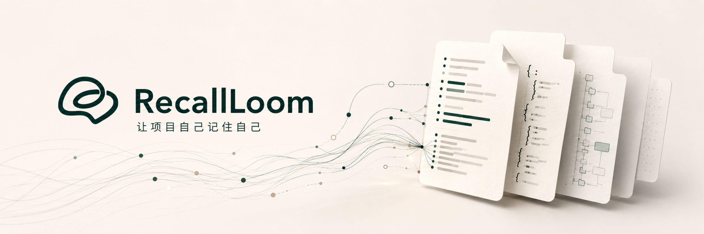
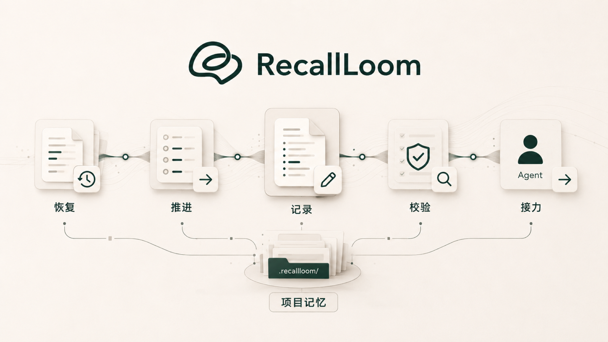
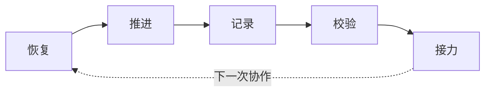
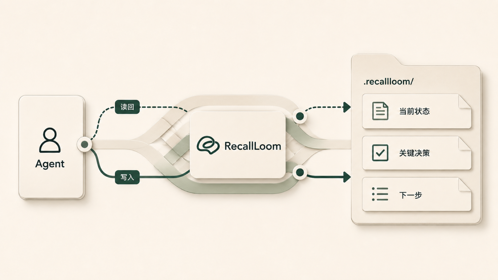

<!-- R1 image slot: docs/images/readme-product-identity.zh-CN.png -->

<p align="center">
  
</p>

<div align="center">

<h1>🧵 RecallLoom</h1>

<p><strong>让项目自己记住自己。</strong></p>

<p>RecallLoom 是给 AI 协作使用的文件化项目记忆层：把背景、进展、关键决策和下一步保存到项目旁边/项目内的 Markdown / JSON 文件里，不需要数据库、RAG 或后台服务。换会话、换模型、换工具，下一次 AI 协作更容易接上当前状态。</p>

[](./skills/recallloom/package-metadata.json)
[](./skills/recallloom/package-metadata.json)
[](./skills/recallloom/SKILL.md)
[](./skills/recallloom/package-metadata.json)
[](./LICENSE)
[](https://github.com/Frappucc1no/recall-loom/stargazers)

[English](./README.en.md) · **简体中文**

</div>

> [!TIP]
> 如果你已经被“隔一段时间回来又要复述十分钟”的重启税折磨过，RecallLoom 的目标很直接：让项目状态、关键决策和下一步留在项目里，让下一次 AI 协作接得上。

**快速跳转：** [为什么需要](#为什么需要-recallloom) · [30 秒开始](#30-秒开始) · [特性](#特性) · [项目记忆循环](#项目记忆循环) · [适合与不适合](#适合与不适合) · [方案对比](#与常见方案对比) · [文档入口](#文档入口) · [FAQ](#faq)

<a id="为什么需要-recallloom"></a>

## 🧭 为什么需要 RecallLoom

长期 AI 协作里，最耗人的常常是反复解释项目。

你可能已经遇到过这些问题：

- 换会话、换模型，或隔几天回来，就要重新说明项目背景、当前进度和不能碰的边界。
- 新 AI 工具能读到仓库里的文件，却不知道哪些事实已经过期、哪些结论仍然有效。
- AI 工具内置记忆（memory）、聊天记录和项目文件分开存在，关键决策很难跟着项目一起走。
- 项目一做久，“为什么这么做”“现在什么是真的”“下一步该接哪里”最容易丢。

RecallLoom 解决的是这层 **项目记忆** 和 **跨会话连续性**。

它把项目背景、当前状态、关键决策、最近进展和下一步，保存在项目旁边的受控文件里。下一次换会话、换模型、换工具，或隔几天回来时，新的 AI 工具可以先接上当前状态，再决定要不要深入历史材料。

这让“记忆”从聊天里的临时解释，变成项目里可读、可审、可继续维护的工程资产。

这份 README 是 RecallLoom 的简明公开入口。安装和日常使用从这里开始；更细的命令用法见 [USAGE.md](./USAGE.md)，安装后的技能行为见 [skills/recallloom/SKILL.md](./skills/recallloom/SKILL.md)，完整仓库地图见 [INDEX.md](./INDEX.md)。

<a id="30-秒开始"></a>

## ⚡ 30 秒开始

目标很简单：安装一次，在支持 skills 的 AI 编程工具里首次接入时初始化，之后在项目里说“继续这个项目”。

前提：你已可使用 Node/npm/npx、Python `3.10+`，并使用能安装/读取 skills 的 AI 编程工具。

说明：skills 安装让 RecallLoom 可被工具读取；`@recallloom` 属于桥接/技能唤起；`rl-*` 是部分 AI coding 工具支持的短触发词。

### 1. 安装 RecallLoom

把下面命令复制到终端。如果你不想处理命令细节，可以把整行交给正在使用的 AI coding 工具执行：

```bash
npx skills add https://github.com/Frappucc1no/recall-loom --skill recallloom
```

之后需要更新已安装技能时：

```bash
npx skills update
```

### 2. 未接入项目先初始化

如果这是第一次在当前项目使用 RecallLoom，需要先初始化项目记忆。已有有效 `.recallloom/` 或 `recallloom/` 的项目可以跳过这一步；如果两者同时存在，应先停止并检查项目状态。

你可以用任意一种显式唤起方式（`@recallloom` 仅在当前 AI 工具支持 @ skill mention 时可用；否则用自然语言或技能选择器）：

```text
@recallloom 初始化当前项目
请用 RecallLoom 接入这个项目
请用 RecallLoom 初始化这个项目
rl-init
```

也可以通过 AI 工具的技能选择器选择 `recallloom`，再说“初始化当前项目”。

> [!NOTE]
> 首次接入会在项目旁边建立 RecallLoom 的项目记忆目录，用来保存背景、进展、关键决策和下一步。

### 3. 日常使用：自然语言继续

项目接入后，常用说法很自然：

```text
继续这个项目
先帮我恢复项目上下文
从上次停下的地方继续
记录今天的关键进展
```

> [!TIP]
> 在已接入的项目里，`继续这个项目` 会让 RecallLoom 先执行恢复步骤：先读取项目记忆，再进入具体任务。日常接力无需每次都写 `@recallloom`。

### 4. 熟悉后可用短触发词

在支持该能力的 AI coding 工具里，这些词可以直接发给 AI 工具，作用类似更短的自然语言触发语：

| 直接输入 | 你想做什么 |
|---|---|
| `rl-init` | **初始化项目记忆**，让 RecallLoom 接入当前项目 |
| `rl-resume` | 恢复项目背景、当前状态和下一步 |
| `rl-status` | 查看项目记忆是否完整、是否需要处理 |
| `rl-validate` | 检查连续性文件有没有结构问题 |

如果当前工具不识别 `rl-*`，使用上面的自然语言触发语即可。

多数时候，说“继续这个项目”就够了；熟悉后再用短触发词提速。

<details>
<summary>版本与兼容性</summary>

<!-- RecallLoom metadata sync start: package-metadata -->
- 包版本：`0.4.8.1`
- 协议版本：`1.0`
- 当前支持的协议版本：
  - `1.0`
<!-- RecallLoom metadata sync end: package-metadata -->

</details>

<details>
<summary>使用环境与入口</summary>

<!-- RecallLoom metadata sync start: runtime-assumptions -->
- Python 版本要求：`3.10` 及以上
- 支持的工作区语言：
  - `en`
  - `zh-CN`
- 支持的入口桥接文件：
  - `AGENTS.md`
  - `CLAUDE.md`
  - `GEMINI.md`
  - `.github/copilot-instructions.md`
<!-- RecallLoom metadata sync end: runtime-assumptions -->

</details>

<a id="特性"></a>

## ✨ 特性

> [!TIP]
> RecallLoom 的收益来自更短的恢复路径：少解释、少重读、少猜测，让 AI 工具先接上当前事实。

| 特性 | 带来的价值 |
|---|---|
| **低重启税** | 换会话、换模型或隔几天回来时，先恢复项目状态 |
| **更快接力** | 先看当前摘要、最近进展和下一步，快速进入状态 |
| **更省上下文** | 先读小而准的项目记忆，深查只在需要时发生 |
| **跨工具接力** | 换模型、换会话、换 AI 工具时，项目事实仍跟着工作区走 |
| **写入更稳** | 进展记录、当前摘要和校验动作有明确路径，降低把过期事实写回项目记忆的风险 |
| **文件化保存** | 记忆落在 Markdown / JSON 文件里，可读、可审、可迁移 |

<a id="核心能力"></a>

## 🧩 核心能力

| 能力 | 对你意味着什么 |
|---|---|
| 恢复项目上下文 | 新的 AI 工具或下一次会话先接上当前事实，减少从零重建项目历史 |
| 记录关键进展 | 把需要长期保留的进展、决策和下一步写回项目旁边 |
| 建议记录时机 | 在形成稳定里程碑时给出脱敏候选和下一步建议，不静默写入 |
| 校验连续性状态 | 在继续或写入前识别缺失、过期、冲突和需要人工确认的风险 |
| 受控更新当前状态 | 写入前后保留修订、新鲜度和校验边界，降低误写旧事实的概率 |
| 预览式修复 | daily-log cursor 异常先诊断、预览和确认，修复后再验证，不手写 `state.json` |
| 多工具接力 | Codex、Claude Code、Gemini 等工具在相应入口可用时，可以从同一套项目记忆继续 |

这些能力连在一起，解决的是一个共同问题：下一次接手项目的 AI 工具，先知道当前状态，再开始行动。

<a id="设计原则"></a>

## 🧱 设计原则

- **项目拥有记忆。** 关键状态写入项目旁边/项目内的普通文件，而不是锁在单次聊天或某个 AI 工具内置记忆里。
- **当前先于全部。** 恢复时先读当前事实、近期进展和下一步，再按需深入历史材料。
- **AI coding 工具只是入口。** 当 AI 工具支持 skills 或对应入口文件时，可以读取或唤起 RecallLoom；长期事实由 RecallLoom 文件承载、审阅和迁移。

<a id="项目记忆循环"></a>

## 🔁 项目记忆循环

RecallLoom 的核心模型可以概括成一个 **典型项目记忆循环**：

<!-- R2 image slot: docs/images/readme-continuity-loop.zh-CN.png -->
<p align="center">
  
</p>



| 阶段 | 发生什么 |
|---|---|
| **恢复** | 下一次会话先读取有限、当前、可信的项目事实 |
| **推进** | AI 工具按恢复出的状态继续工作 |
| **记录** | 把关键进展、决策和下一步写回项目记忆 |
| **校验** | 检查连续性文件是否完整、过期或冲突 |
| **接力** | 下一次会话从这些文件继续 |

这套循环把“记忆”落成可检查的工程动作：先恢复可信事实，再推进工作，最后把新的关键事实写回项目。

<details>
<summary>项目记忆实际保存在哪里？</summary>

循环背后对应几类文件：

| 你关心的问题 | RecallLoom 保存在哪里 |
|---|---|
| 这个项目是什么，为什么这么做 | `context_brief.md` |
| 当前进行到哪里，哪些事实仍然有效 | `rolling_summary.md` |
| 最近真正发生了什么 | `daily_logs/YYYY-MM-DD.md` |
| 哪些规则、边界和状态需要谨慎处理 | `config.json`、`state.json`、`update_protocol.md` |

</details>

<a id="适合与不适合"></a>

## 🎯 适合与不适合

RecallLoom 最适合这些场景：

| 场景 | 价值 |
|---|---|
| 长期软件项目 | 让 AI 工具接上当前实现状态、关键决策、阻塞项和下一步 |
| 产品 / PRD / RFC 写作 | 保留范围变化、决策原因、待定问题和协作脉络 |
| 研究写作 | 维护论点、证据、来源边界和写作进度 |
| 多 AI 工具接力 | 换模型、换工具、换会话时减少项目状态丢失 |
| 私有或本地优先工作区 | 项目状态留在工作区内，更容易审计和迁移；隐私仍取决于你的同步和托管设置 |

> [!IMPORTANT]
> RecallLoom 专注项目连续性，不替代知识库、数据库、后台服务或自动执行框架。

它不适合：

- 一次性问答或临时聊天。
- 只想要聊天记录摘要。
- 需要工具自动整理整个仓库。
- 需要任务编排、步骤调度或多 agent 执行；RecallLoom 只维护项目连续性状态。
- 需要完整知识库、后台服务或自动执行框架的系统。
- 希望工具未经确认就自动抽取、自动合并、自动改写长期事实。

<a id="与常见方案对比"></a>

## 🆚 与常见方案对比

以下对照基于公开资料和常见使用方式，只比较相邻方案的定位边界，不做产品排名。很多方案可以和 RecallLoom 并存；关键是先判断你要解决的是“工具怎么工作”“工具看见什么”“任务或执行怎么推进”，还是“项目下一次从哪里继续”。

| 用户在选什么 | 代表方案 | 主要用途 | 已经够用的情况 | RecallLoom 补哪一层 |
|---|---|---|---|---|
| Agent 规则 / 指令文件 | [`AGENTS.md`](https://agents.md/)、`CLAUDE.md`、`GEMINI.md`、[Cursor Rules](https://cursor.com/docs/rules) | 告诉 AI 工具编码规范、测试命令、项目约束和工作方式 | 主要问题是“agent 不按这个仓库的约定做事” | 规则管“怎么做”；RecallLoom 记录项目到哪了、为什么这样、下一步接哪里 |
| AI 工具内置记忆 | [Claude Code memory](https://code.claude.com/docs/en/memory)、Cursor Memories、ChatGPT Memory、Gemini CLI memory | 在单一 AI 工具内保留偏好、习惯和部分跨对话上下文 | 你基本固定使用同一个 AI 工具，主要想保留个人偏好或长期习惯 | 把项目连续性放进可读、可审、可随项目迁移的文件里 |
| 项目记忆 / AI 编码工作台 | [Trellis](https://github.com/mindfold-ai/Trellis) 等 | 更宽的团队 AI 编码工作台：规格、工作流、任务上下文、记忆和多平台接入 | 你需要一套团队 AI 编码工作台，而不只是项目连续性层 | RecallLoom 更窄，只做项目连续性：当前状态、决策、近期进展和继续工作的起点 |
| 任务图 / issue 记忆 | [Beads](https://github.com/steveyegge/beads)、git-backed issue/task graph | 维护结构化任务、依赖、状态和 issue 关系 | 你要管理的是任务图、优先级、依赖或 issue 流转 | RecallLoom 不是 issue tracker；它维护当前状态、决策、近期进展和接力摘要 |
| 工作流执行框架 | [LangGraph](https://docs.langchain.com/oss/python/langgraph/overview) 等 | 编排 agent / workflow 的执行状态、持久化和恢复 | 你需要恢复程序执行状态、节点状态或工作流运行状态 | RecallLoom 恢复人和 AI 的项目协作上下文，不替代工作流运行环境或执行框架 |
| RAG / 向量数据库 | LangChain RAG、[Chroma](https://docs.trychroma.com/docs/embeddings/embedding-functions)、[Qdrant](https://qdrant.tech/documentation/) | 从大量材料里检索相关片段、文档或语义上下文 | 问题是“资料很多，需要找相关内容” | RecallLoom 维护小而可信的项目恢复点，不替代知识库、RAG 或向量库 |
| 手写 README / 文档 / 交接笔记 | `HANDOFF.md`、README TODO、session summary、团队 wiki | 给人留下说明、任务列表或一次性暂停点 | 项目很短，或只需要一次手工交接 | 把交接笔记变成可重复维护、可审阅、可校验的恢复循环 |

简化判断：规则管“怎么做”，检索工具帮“看见什么”，工作台 / issue 工具 / 执行框架管任务或执行过程，知识库管长期材料；RecallLoom 关注项目当前状态、下一步，以及这些事实如何被下一次 AI 会话恢复。

<a id="工程设计"></a>

## 🏗️ 工程设计

RecallLoom 的工程原则很简单：项目事实留在项目里，AI 工具只是进入项目的入口。

<!-- R3 image slot: docs/images/readme-architecture-boundary.zh-CN.png -->
<p align="center">
  
</p>

| 设计 | 含义 |
|---|---|
| 项目旁边的记忆目录 | `.recallloom/` 跟着工作区走，项目换工具时仍能恢复 |
| 普通文件承载事实 | 关键状态写在可读的 Markdown / JSON 文件里，便于审阅、回退和迁移 |
| 先当前，后历史 | 先读当前状态和关键事实，必要时再进入更深历史材料 |
| 写入保护 | 更新长期事实前后检查修订、新鲜度和结构，降低把过期事实写回项目记忆的风险 |
| 工具只负责接入 | Codex、Claude Code、Gemini 等工具在支持对应入口时可作为唤起入口；项目事实由 RecallLoom 文件承载 |

更细的脚本入口、协议和文件契约，放在 [`USAGE.md`](./USAGE.md) 与 [`skills/recallloom/references/`](./skills/recallloom/references/)。

### 安全与信任

- 项目记忆默认保存在工作区附近的普通文件中，便于审阅、diff、回退和迁移。
- RecallLoom 不需要数据库、RAG 层或后台服务。
- 诊断、读取和写入路径有明确边界；长期事实更新会经过修订、新鲜度和结构检查。
- 隐私取决于你如何同步、提交、托管或分享这些项目文件。

<a id="版本迭代"></a>

## 🕰️ 版本迭代

| 版本 | 重点更新 | 对用户的价值 |
|---|---|---|
| `v0.4.8.1` | 窄范围升级兼容热修复：`v0.4.8` 现在可以准确接受由公开 `v0.4.6.2-v0.4.7` recording 实现合法生成的 finalized receipt；未知 receipt identity 仍保持拒绝 | 使用旧版正常记录过项目记忆的用户升级后不会再被误判为 receipt store 损坏；无需迁移 sidecar 或重写历史 receipt |
| `v0.4.8` | 连续写入与失败恢复根因修复：初始化后的多文件写入不再因半成品收据状态互相卡住；失败结果按可安全重试、需复核和不可继续路径分流；断网时本地工作仍可继续；修复约数文本误判路径、合法 symlink 误拦、bidi 控制符和逻辑工作日边界问题 | 首次接入后的连续记录更可靠，遇到异常时下一步更清楚；版本检查暂时不可用时不会把本地工作一并锁住；真实本地路径和合法项目链接更不容易被误报或回显 |
| `v0.4.7` | 记录与修复体验升级：普通 `record --plan` 收敛为结论、原因和唯一下一步；新增无副作用 `record --suggest`；状态摘要与确认材料口径统一；daily-log cursor repair 增加 preview binding、修复后复核和跨平台本地路径隐私保护 | 推荐所有用户升级；“记录一下”和异常修复更短、更清楚，agent 可以建议记录时机但不会静默写入，敏感本地路径不会在普通、完整或 compact 输出中原样回显 |
| `v0.4.6.2` | 0.4.6 线内紧急 P0 修复：append、write、sync、recovery follow-up 统一经过 strict sidecar integrity gate；strict validation 失败时不再发放写入绑定或展示危险重试命令 | 强烈建议 v0.4.6.1 及更早用户更新；异常 sidecar 状态下更难误写项目记忆，失败后更明确转向 review / repair |
| `v0.4.6.1` | 0.4.6 线内紧急修复：升级后的历史 receipt store 可以继续安全 append；`record --plan` 更准确识别“不用记录/只是确认”等 no-write 意图；blocked / invalid 输入不再展示错误写命令；support advisory 当天刷新与子 helper 继承更稳 | 已更新到 v0.4.6 的用户也建议升级；真实项目不会因历史收据契约差异卡死，记录计划和失败恢复更少误导，升级提醒更及时 |
| `v0.4.6` | 推荐所有用户更新的 recording workflow fast lane：新增 `record --plan`、记录分类和安全下一步；append 后支持受控 metadata-only refresh；compact 输出和记录模板同步更新 | “帮我记一下”从多轮工具考古变成先拿清晰计划和当前安全命令；append/sync 高频尾部不再默认要求手工重写完整 current-state JSON |
| `v0.4.5` | Windows stdin / CRLF 换行修复；managed text 写入使用显式 LF，receipt post-hash 读回保留真实 bytes 差异 | PowerShell / Windows 管道输入不再因平台换行转换触发 post-hash mismatch；已有 blocked workspace 仍需按恢复边界处理 |
| `v0.4.4` | daily-log cursor 修复、空 scaffold / legacy 无日志兼容、失败 UX 与 provenance guard 加固 | 可先预览再显式修复 cursor，不必手写 `state.json`；恢复、归档和读取路径对 daily-log 解析更一致 |
| `v0.4.3` | 恢复导入输入通道 hotfix；recovery proposal / review helpers 支持 `--stdin`，文件输入继续保持安全拦截 | 旧项目记忆需要 review import 时，可以走标准恢复链路，不必绕过 helper 或手写 sidecar 文件 |
| `v0.4.2` | 本地 provenance 核心、helper receipt 绑定、写入前新鲜度检查、显式 provenance 验证 lane 和非侵入式 UX gate | 让受控项目记忆写入更可追溯，降低篡改/陈旧状态被误当作可信当前状态的风险，同时保持协议兼容 |
| `v0.4.1` | 后续安全加固、恢复来源输入加固、离线支持状态的写入保护、公开失败路径脱敏和恢复目录边界收紧 | 在保持协议兼容的同时，降低异常输入、陈旧支持状态和本地路径暴露带来的操作风险 |
| `v0.4.0` | 更准确的恢复路径、更低摩擦的进展更新、更清楚的写入保护和工具边界 | 多会话、多模型、多工具接力更稳；记录进展后更容易知道下一步该同步什么 |
| `v0.3.5` | 更快恢复、结构化进展记录、写入前预览、支持状态校验 | 当前项目更容易从已有项目记忆接上，写入前能看到风险提示 |
| `v0.3.4` | 安装/更新状态检查、初始化隐私边界和安全写入基础 | 让更新状态和本地项目记忆更可控 |
| `v0.3.x` | 用普通文件保存项目状态、统一入口、查询、每日记录、当前摘要的早期能力 | 建立 RecallLoom 的基础项目记忆模型 |

<a id="文档入口"></a>

## 🗺️ 文档入口

| 你想做什么 | 去哪里 |
|---|---|
| 判断 RecallLoom 是否适合你 | 本 README |
| 快速安装和恢复项目 | 本 README 的 30 秒开始 |
| 查看脚本和操作细节 | [`USAGE.md`](./USAGE.md) |
| 查看 AI 工具读取的技能说明 | [`skills/recallloom/SKILL.md`](./skills/recallloom/SKILL.md) |
| 查看协议、文件契约和桥接细节 | [`skills/recallloom/references/`](./skills/recallloom/references/) |
| 贡献改动或提出改进 | [`CONTRIBUTING.md`](./CONTRIBUTING.md) |
| 获取支持或报告使用问题 | [`SUPPORT.md`](./SUPPORT.md) |
| 报告安全问题 | [`SECURITY.md`](./SECURITY.md) |
| 查看版本发布记录 | [GitHub Releases](https://github.com/Frappucc1no/recall-loom/releases) |

<a id="faq"></a>

## ❓ FAQ

<details>
<summary>RecallLoom 会自动改我的代码吗？</summary>

RecallLoom 的默认工作对象是项目连续性文件。业务代码仍由你和 AI 工具按正常流程修改；需要沉淀长期事实时，再通过受控脚本写入项目记忆。

</details>

<details>
<summary>它和 AI 工具内置记忆是什么关系？</summary>

AI 工具内置记忆可以作为辅助提示。RecallLoom 的事实落点在项目旁边的记忆目录里，项目状态、关键决策和下一步保存在项目文件中。

</details>

<details>
<summary>它需要数据库、后台服务或 RAG 吗？</summary>

不需要。RecallLoom 不是数据库、向量库/RAG 层或后台服务；它用项目里的可读文本文件保存连续性事实，便于审阅、回退和迁移。

</details>

<details>
<summary>它适合非代码项目吗？</summary>

适合，只要这个项目需要跨天、跨会话、跨工具继续。研究写作、产品文档、RFC、课程项目和工程协调都可以受益。

</details>

<details>
<summary>已经存在的项目能接入吗？</summary>

可以。首次接入时，RecallLoom 会建立项目记忆目录，并把当前项目状态整理成后续可恢复的起点。它不会要求你把原项目目录结构改成某种专用格式。

</details>

<details>
<summary>为什么不直接让 AI 工具读完整个仓库？</summary>

完整仓库读取成本高，也不一定能判断哪些历史事实仍然有效。RecallLoom 先给 AI 工具一个更小、更可信的恢复起点，再在需要时进入更深材料。

</details>

<a id="致谢"></a>

## 🙏 致谢

感谢 [Linux.do 社区](https://linux.do/) 的讨论、反馈与支持。

<a id="license"></a>

## 📄 License

Apache-2.0. See [`LICENSE`](./LICENSE).
