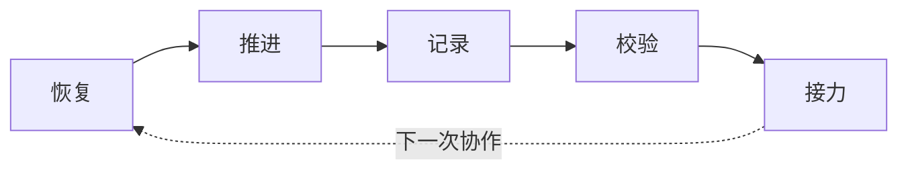

<!-- R1 image slot: docs/images/readme-product-identity.zh-CN.png -->

<p align="center">
  
</p>

<div align="center">

<h1>🧵 RecallLoom</h1>

<p><strong>让项目自己记住自己。</strong></p>

<p>把背景、进展、关键决策和下一步留在项目文件里。换会话、换模型、换工具，下一次 AI 协作也能接上当前状态。</p>

[](./docs/releases/v0.4.0.md)
[](./skills/recallloom/package-metadata.json)
[](./skills/recallloom/package-metadata.json)
[](./LICENSE)
[](https://github.com/Frappucc1no/recall-loom/stargazers)

[English](./README.en.md) · **简体中文**

</div>

> [!TIP]
> 如果你已经被“隔一段时间回来又要复述十分钟”的重启税折磨过，RecallLoom 的目标很直接：让项目状态、关键决策和下一步留在项目里，让下一次 AI 协作接得上。

| 记住什么 | 什么时候接力 | 记忆放在哪里 |
|---|---|---|
| 背景、进展、关键决策、下一步 | 换会话、换模型、换工具、隔几天回来 | 项目内的 Markdown / JSON 文件 |

**快速跳转：** [为什么需要](#为什么需要-recallloom) · [30 秒开始](#30-秒开始) · [特性](#特性) · [核心能力](#核心能力) · [项目记忆循环](#项目记忆循环) · [适合与不适合](#适合与不适合) · [方案对比](#与常见方案对比) · [工程设计](#工程设计) · [版本迭代](#版本迭代) · [FAQ](#faq)

## 🧭 为什么需要 RecallLoom

长期 AI 协作里，最耗人的常常是反复解释项目。

你可能已经遇到过这些问题：

- 换会话、换模型，或隔几天回来，就要重新说明项目背景、当前进度和不能碰的边界。
- 新 AI 工具能读到仓库里的文件，却不知道哪些事实已经过期、哪些结论仍然有效。
- 平台记忆（memory）、聊天记录和项目文件分开存在，关键决策很难跟着项目一起走。
- 项目一做久，“为什么这么做”“现在什么是真的”“下一步该接哪里”最容易丢。

RecallLoom 解决的是这层 **项目记忆** 和 **接力连续性**。

它把项目背景、当前状态、关键决策、最近进展和下一步，保存在项目旁边的受控文件里。下一次换会话、换模型、换工具，或隔几天回来时，新的 AI 工具可以先接上当前真相，再决定要不要深入历史材料。

这让“记忆”从聊天里的临时解释，变成项目里可读、可审、可继续维护的工程资产。

这份 README 是 RecallLoom 的简明公开入口。安装和日常使用从这里开始；更细的命令用法见 [USAGE.md](./USAGE.md)，安装后的技能行为见 [skills/recallloom/SKILL.md](./skills/recallloom/SKILL.md)，完整仓库地图见 [INDEX.md](./INDEX.md)。

## ⚡ 30 秒开始

目标很简单：安装一次，首次接入时初始化，之后在项目里直接说“继续这个项目”。

### 1. 安装 RecallLoom

把下面命令复制到终端。如果你不想处理命令细节，可以把整行交给正在使用的 AI coding 工具执行：

```bash
npx skills add https://github.com/Frappucc1no/recall-loom --skill recallloom
```

之后需要更新已安装技能时：

```bash
npx skills update
```

### 2. 首次初始化（可选）

如果这是第一次在当前项目使用 RecallLoom，需要先初始化项目记忆。已有 `.recallloom/` 的项目可以跳过这一步。

你可以用任意一种显式唤起方式：

```text
@recallloom 初始化当前项目
请用 RecallLoom 接管这个项目
请用 RecallLoom 初始化这个项目
rl-init
```

也可以通过 AI 工具的技能选择器选择 `recallloom`，再说“初始化当前项目”。

> [!NOTE]
> 首次接入会在项目旁边建立 RecallLoom 的项目记忆目录，用来保存背景、进展、关键决策和下一步。

### 3. 日常使用：自然语言继续

项目接入后，常用说法很自然：

```text
继续这个项目
先帮我恢复项目上下文
从上次停下的地方继续
记录今天的关键进展
```

> [!TIP]
> 在已接入的项目里，`继续这个项目` 会让 RecallLoom 先执行恢复步骤：先读取项目记忆，再进入具体任务。日常接力无需每次都写 `@recallloom`。

### 4. 熟悉后可用短触发词

这些词可以直接发给 AI 工具，作用类似更短的自然语言触发语：

| 直接输入 | 你想做什么 |
|---|---|
| `rl-init` | **初始化项目记忆**，让 RecallLoom 接管当前项目 |
| `rl-resume` | 恢复项目背景、当前状态和下一步 |
| `rl-status` | 查看项目记忆是否完整、是否需要处理 |
| `rl-validate` | 检查连续性文件有没有结构问题 |

多数时候，说“继续这个项目”就够了；熟悉后再用短触发词提速。

<details>
<summary>版本与兼容性</summary>

<!-- RecallLoom metadata sync start: package-metadata -->
- 包版本：`0.4.0`
- 协议版本：`1.0`
- 当前支持的协议版本：
  - `1.0`
<!-- RecallLoom metadata sync end: package-metadata -->

</details>

<details>
<summary>使用环境与入口</summary>

<!-- RecallLoom metadata sync start: runtime-assumptions -->
- Python 版本要求：`3.10` 及以上
- 支持的工作区语言：
  - `en`
  - `zh-CN`
- 支持的入口桥接文件：
  - `AGENTS.md`
  - `CLAUDE.md`
  - `GEMINI.md`
  - `.github/copilot-instructions.md`
<!-- RecallLoom metadata sync end: runtime-assumptions -->

</details>

## ✨ 特性

> [!TIP]
> RecallLoom 的收益来自更短的恢复路径：少解释、少重读、少猜测，让 AI 工具先接上当前事实。

| 特性 | 带来的价值 |
|---|---|
| **低重启税** | 换会话、换模型或隔几天回来时，先恢复项目状态 |
| **更快接力** | 先看当前摘要、最近进展和下一步，快速进入状态 |
| **更省上下文** | 先读小而准的项目记忆，深查只在需要时发生 |
| **跨工具接力** | 换模型、换会话、换 AI 工具时，项目事实仍跟着工作区走 |
| **写入更稳** | 进展记录、当前摘要和校验动作有明确路径，降低把过期事实写回项目记忆的风险 |
| **文件化保存** | 记忆落在 Markdown / JSON 文件里，可读、可审、可迁移 |

## 🧩 核心能力

| 能力 | 对你意味着什么 |
|---|---|
| 恢复项目上下文 | 新的协作入口先接上当前事实，减少从零重建项目历史 |
| 记录关键进展 | 把需要长期保留的进展、决策和下一步写回项目旁边 |
| 校验连续性状态 | 在继续或写入前识别缺失、过期、冲突和需要人工确认的风险 |
| 受控更新当前状态 | 写入前后保留修订、新鲜度和校验边界，降低误写旧事实的概率 |
| 多工具接力 | Codex、Claude Code、Gemini 等工具都可以从同一套项目记忆继续 |

这些能力连在一起，解决的是一个共同问题：下一次接手项目的 AI 工具，先知道当前真相，再开始行动。

## 🔁 项目记忆循环

RecallLoom 的核心模型可以概括成一个 **典型项目记忆循环**：

<!-- R2 image slot: docs/images/readme-continuity-loop.zh-CN.png -->
<p align="center">
  
</p>



| 阶段 | 发生什么 |
|---|---|
| **恢复** | 新的协作入口先读取有限、当前、可信的项目事实 |
| **推进** | AI 工具按恢复出的状态继续工作 |
| **记录** | 把关键进展、决策和下一步写回项目记忆 |
| **校验** | 检查连续性文件是否完整、过期或冲突 |
| **接力** | 下一次会话从这些文件继续 |

这套循环把“记忆”落成可检查的工程动作：先恢复可信事实，再推进工作，最后把新的关键事实写回项目。

<details>
<summary>项目记忆实际保存在哪里？</summary>

循环背后对应几类文件：

| 你关心的问题 | RecallLoom 保存在哪里 |
|---|---|
| 这个项目是什么，为什么这么做 | `context_brief.md` |
| 当前进行到哪里，哪些事实仍然有效 | `rolling_summary.md` |
| 最近真正发生了什么 | `daily_logs/YYYY-MM-DD.md` |
| 哪些规则、边界和状态需要谨慎处理 | `config.json`、`state.json`、`update_protocol.md` |

</details>

## 🎯 适合与不适合

RecallLoom 最适合这些场景：

| 场景 | 价值 |
|---|---|
| 长期软件项目 | 让 AI 工具接上当前实现状态、关键决策、阻塞项和下一步 |
| 产品 / PRD / RFC 写作 | 保留范围变化、决策原因、待定问题和协作脉络 |
| 研究写作 | 维护论点、证据、来源边界和写作进度 |
| 多 AI 工具接力 | 换模型、换工具、换会话时不丢项目现实 |
| 私有或本地优先工作区 | 项目状态留在工作区内，更容易审计和迁移 |

> [!IMPORTANT]
> RecallLoom 专注项目连续性，不替代知识库、数据库、后台服务或自动执行框架。

它不适合：

- 一次性问答或临时聊天。
- 只想要聊天记录摘要。
- 需要工具自动整理整个仓库。
- 需要完整知识库、后台服务或自动执行框架的系统。
- 希望工具未经确认就自动抽取、自动合并、自动改写长期事实。

## 🆚 与常见方案对比

以下对照基于公开资料和常见使用方式，只比较相邻方案的定位边界，不做产品排名。很多方案可以和 RecallLoom 并存；当问题从“让工具按规则工作”升级为“让项目跨会话、跨工具持续接得上”时，RecallLoom 的价值更明显。

| 类似方案 | 代表对象 | 更适合什么 | RecallLoom 的不同 |
|---|---|---|---|
| Agent 指令 / 规则文件 | `CLAUDE.md`、`AGENTS.md`、Cursor Rules、Continue rules | 保存编码规范、测试命令、项目约束和工具行为规则 | 保存项目当前事实、近期进展、关键决策和下一步，不只告诉 agent 怎么做 |
| 平台内记忆 | Claude Code auto memory、ChatGPT Memory | 个人偏好、常用习惯和单一宿主内的连续体验 | 把可读上下文留在项目文件里，跟随工作区跨工具接力 |
| 代码库上下文 / 检索 | Aider repo map、Continue context providers | 帮 agent 找到相关代码、文件、符号和外部资料 | 让 agent 先知道项目现在走到哪，再决定要深入哪些材料 |
| 结构化 AI 项目记忆 | Cline Memory Bank、`project-brain` | 用 Markdown 显式保存项目 brief、active context、progress 和交接信息 | 保留文件化交接思路，同时提供可安装技能、明确桥接目标、状态检查、校验和受控更新路径 |
| 人用知识库 / 团队 Wiki | Obsidian、Logseq、Notion | 研究笔记、链接知识、团队文档和长期检索 | 面向 AI 会话恢复，提供更短的当前状态恢复路径 |
| 手工交接 | `HANDOFF.md`、session summary、README TODO、issue 记录 | 暂停一次、交接一次或记录任务列表 | 把一次性总结变成可持续维护、可审阅、可校验的项目记忆循环 |

简化判断：rules 管“怎么做”，检索工具帮“看见什么”，知识库存“知道什么”；RecallLoom 更关注“项目现在在哪、下一步接哪里”。

## 🏗️ 工程设计

RecallLoom 的工程原则很简单：项目事实留在项目里，AI 工具只是进入项目的入口。

<!-- R3 image slot: docs/images/readme-architecture-boundary.zh-CN.png -->
<p align="center">
  
</p>

| 设计 | 含义 |
|---|---|
| 项目旁边的记忆目录 | `.recallloom/` 跟着工作区走，项目换工具时仍能恢复 |
| 普通文件承载事实 | 关键状态写在可读的 Markdown / JSON 文件里，便于审阅、回退和迁移 |
| 先当前，后历史 | 先读当前状态和关键事实，必要时再进入更深历史材料 |
| 写入保护 | 更新长期事实前后检查修订、新鲜度和结构，降低把过期事实写回项目记忆的风险 |
| 工具只负责接入 | Codex、Claude Code、Gemini 等工具负责唤起；项目事实由 RecallLoom 文件承载 |

更细的脚本入口、协议和文件契约，放在 [`USAGE.md`](./USAGE.md) 与 [`skills/recallloom/references/`](./skills/recallloom/references/)。

## 🕰️ 版本迭代

| 版本 | 重点更新 | 对用户的价值 |
|---|---|---|
| `v0.4.0` | 更准确的恢复路径、更低摩擦的进展更新、更清楚的写入保护和工具边界 | 多会话、多模型、多工具接力更稳；记录进展后更容易知道下一步该同步什么 |
| `v0.3.5` | 更快恢复、结构化进展记录、写入前预览、支持状态校验 | 当前项目更容易从已有项目记忆接上，写入前能看到风险提示 |
| `v0.3.4` | 安装/更新状态检查、初始化隐私边界和安全写入基础 | 让更新状态和本地项目记忆更可控 |
| `v0.3.x` | 用普通文件保存项目状态、统一入口、查询、每日记录、当前摘要的早期能力 | 建立 RecallLoom 的基础项目记忆模型 |

## 🗺️ 文档入口

| 你想做什么 | 去哪里 |
|---|---|
| 判断 RecallLoom 是否适合你 | 本 README |
| 快速安装和恢复项目 | 本 README 的 30 秒开始 |
| 查看脚本和操作细节 | [`USAGE.md`](./USAGE.md) |
| 查看 AI 工具读取的技能说明 | [`skills/recallloom/SKILL.md`](./skills/recallloom/SKILL.md) |
| 查看协议、文件契约和桥接细节 | [`skills/recallloom/references/`](./skills/recallloom/references/) |
| 查看版本发布记录 | [GitHub Releases](https://github.com/Frappucc1no/recall-loom/releases) |

## ❓ FAQ

### RecallLoom 会自动改我的代码吗？

RecallLoom 的默认工作对象是项目连续性文件。业务代码仍由你和 AI 工具按正常流程修改；需要沉淀长期事实时，再通过受控脚本写入项目记忆。

### 它和平台记忆是什么关系？

平台记忆可以作为辅助提示。RecallLoom 的事实落点在项目旁边的记忆目录里，项目状态、关键决策和下一步保存在项目文件中。

### 它需要数据库、后台服务或 RAG 吗？

默认不需要。RecallLoom 用项目里的可读文本文件保存连续性事实，便于审阅、回退和迁移。

### 它适合非代码项目吗？

适合，只要这个项目需要跨天、跨会话、跨工具继续。研究写作、产品文档、RFC、课程项目和工程协调都可以受益。

### 已经存在的项目能接入吗？

可以。首次接入时，RecallLoom 会建立项目记忆目录，并把当前项目状态整理成后续可恢复的起点。它不会要求你把原项目目录结构改成某种专用格式。

### 为什么不直接让 AI 工具读完整个仓库？

完整仓库读取成本高，也不一定能判断哪些历史事实仍然有效。RecallLoom 先给 AI 工具一个更小、更可信的恢复入口，再在需要时进入更深材料。

## 🙏 致谢

感谢 [Linux.do 社区](https://linux.do/) 的讨论、反馈与支持。

## 📄 License

Apache-2.0. See [`LICENSE`](./LICENSE).

---
